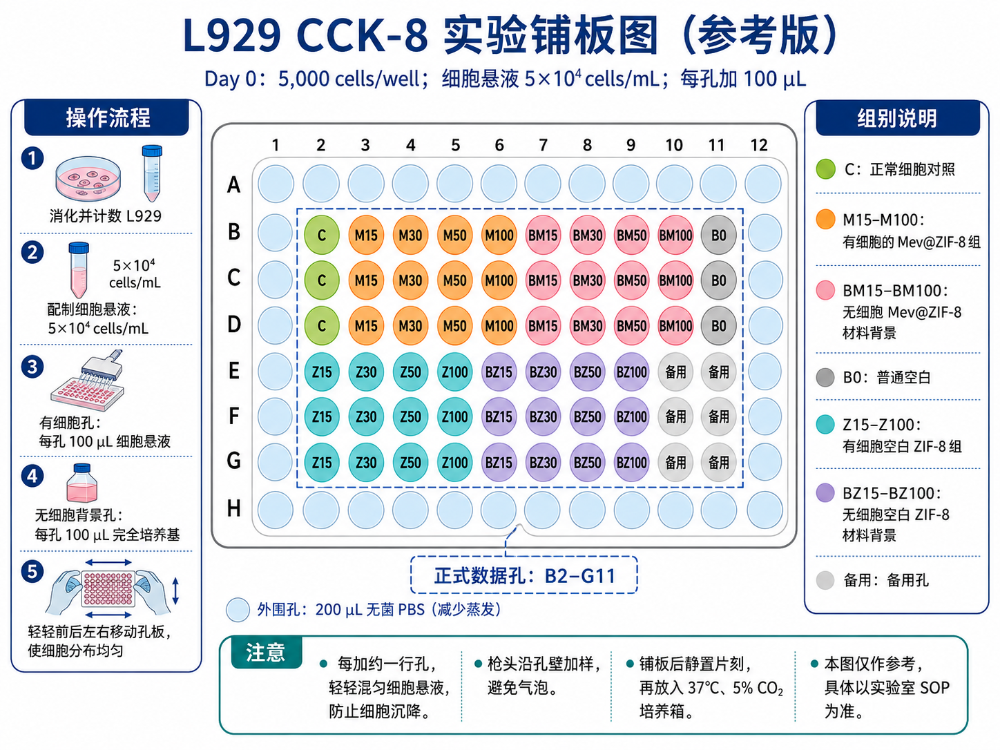
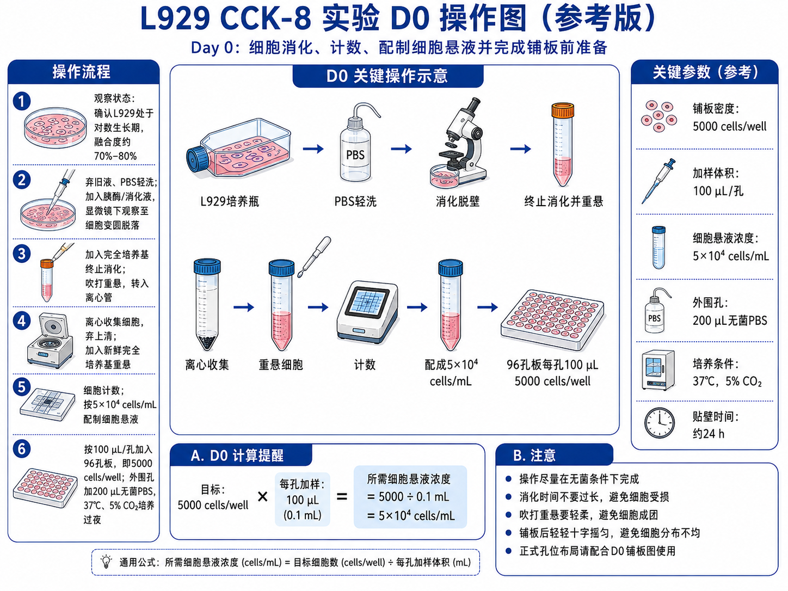
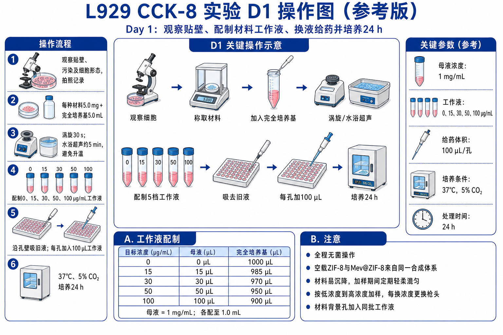

# Design Experiment Visual Guides

[简体中文](README.md) | [English](README.en.md)

[](https://github.com/x765254958/design-experiment-visual-guides/actions/workflows/validate.yml)

一个用于“实验方案设计 → 萌新操作手册 → 逐日实验操作图”的 Codex Skill。

它不会直接把一个模糊想法画成流程图，而是先核对研究目的、分组、浓度、时间、对照和实验依赖关系，再从同一份实验规格文件生成文字方案、铺板图、计算表及 D0/D1/D2 操作图，尽量避免不同材料之间的参数冲突。

## 主要用途

- 根据研究目的和实验室现有条件整理实验设计；
- 区分已确认参数、文献参数、预实验参数和待确认参数；
- 设计分组、浓度梯度、对照、重复和实验先后顺序；
- 生成面向新手的逐步实验手册；
- 生成铺板图、分组图、时间线和逐日操作图；
- 检查方案、表格和图片中的组名、剂量、体积、单位与时间是否一致；
- 将现有 SOP、论文方法或实验笔记整理成可执行的实验资料包。

当前仓库提供 L929 CCK-8 和双菌株 CFU 平板计数的结构化示例。示例参数用于展示设计方法，不代表适用于所有实验室的固定标准。

## 工作流程

```text
研究目的与现有条件
        ↓
参数分类与待确认项
        ↓
分组、对照、浓度、重复及依赖关系
        ↓
冻结 experiment_spec.json
        ↓
实验方案 / 萌新操作手册 / 计算表
        ↓
铺板图与 D0、D1、D2 操作图
        ↓
跨文件一致性检查
```

## 输出示例

下面的图片展示了该 Skill 希望生成的两类互补资料：精确的孔板布局图，以及按实验日拆分的操作指导图。图片中的参数仅对应示例项目，正式实验应从已确认的 `experiment_spec.json` 重新生成。

### D0：铺板布局与操作准备

<p align="center">
  
  
</p>

### D1：材料处理操作

<p align="center">
  
</p>

## 输出模式

| 模式 | 输出内容 |
| --- | --- |
| `design-only` | 研究逻辑、分组、指标、先后顺序和待解决问题 |
| `protocol` | 实验设计、方法步骤和记录要求 |
| `beginner-manual` | 可供新手执行的逐日步骤、计算、检查点和原始记录表 |
| `visual-pack` | 铺板图、布局图、时间线及逐日操作图 |
| `full-pack` | 实验规格、方案、手册、视觉提示词和最终图片 |

## 安装

将仓库克隆到 Codex 的 skills 目录：

```powershell
git clone https://github.com/x765254958/design-experiment-visual-guides.git `
  "$env:USERPROFILE\.codex\skills\design-experiment-visual-guides"
```

重新打开 Codex 任务后，可在请求中明确调用：

```text
Use $design-experiment-visual-guides to design my CCK-8 experiment and
generate a beginner manual, plate map, and D0/D1/D2 operation visuals.
```

也可以直接使用中文：

```text
使用 $design-experiment-visual-guides，根据我的研究目的和实验室条件，
先核对分组与浓度，再生成萌新操作手册、铺板图和逐日操作图。
```

## 快速开始

### 1. 初始化实验项目

```bash
python scripts/init_experiment_project.py \
  --name l929-cck8-pilot \
  --out ./work
```

### 2. 编辑实验规格

根据实际条件修改：

```text
work/l929-cck8-pilot/experiment_spec.json
```

规格文件示例位于 [`assets/experiment-spec.example.json`](assets/experiment-spec.example.json)。

### 3. 校验规格

```bash
python scripts/validate_experiment_spec.py \
  work/l929-cck8-pilot/experiment_spec.json
```

- `ERROR`：必须修改后才能继续；
- `WARNING`：需要在正式实验前确认，并保留在手册中；
- 通过校验不等于实验方案已经获得伦理、生物安全或实验室审批。

### 4. 生成逐日操作图提示词

```bash
python scripts/build_visual_prompt.py \
  work/l929-cck8-pilot/experiment_spec.json \
  --out work/l929-cck8-pilot/visual-prompts
```

精确铺板位置、数字和计算应优先使用表格或确定性图形制作；插画生成后仍需逐项检查标签、单位、箭头、仪器和操作顺序。

## 参数证据等级

| 等级 | 含义 |
| --- | --- |
| `confirmed` | 来自实验室确认、厂家资料、已批准 SOP 或用户明确提供 |
| `literature` | 来自可引用的原始研究文献 |
| `provisional` | 建议作为预实验起始条件，尚未验证 |
| `unknown` | 尚未解决且可能改变实验设计 |

该 Skill 不会把预实验参数写成“规定”“标准”或已经证实的条件。

## 仓库结构

```text
.
├── SKILL.md                         # Skill 主指令
├── agents/openai.yaml              # Codex 展示与默认提示词
├── assets/
│   ├── experiment-spec.example.json
│   └── style-reference/             # CCK-8 操作图参考版式
├── references/                      # 设计、输出、安全与视觉规范
├── scripts/                         # 初始化、校验和视觉提示词脚本
└── .github/workflows/validate.yml   # GitHub 自动校验
```

## 安全边界

涉及活微生物、原代人体材料、转基因操作、危险化学品或动物实验时，具体操作必须服从所在单位的培训、SOP、伦理和生物安全要求。本仓库用于整理和核对实验设计，不替代本地审批，也不会自动补写未经确认的麻醉、感染、灭菌、处置或废弃物处理参数。

## 开发与校验

安装 PyYAML 后运行：

```bash
python scripts/validate_skill_package.py .
python -m py_compile scripts/*.py
```

每次推送到 `main` 或提交 Pull Request 时，GitHub Actions 会自动检查 Skill 结构和必要资源。

## 说明

本项目的目标是让实验方案、操作手册和实验图片共享同一套参数来源，从而提高可执行性与可审查性。预期结果图只能用于说明计划获得的数据形式，不应被表述为真实实验结果。
